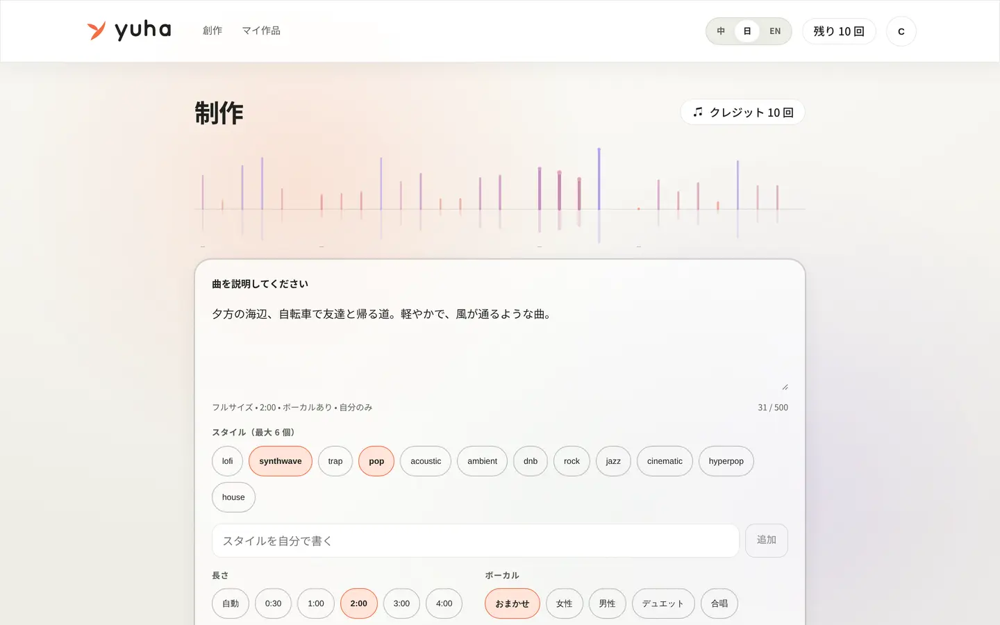
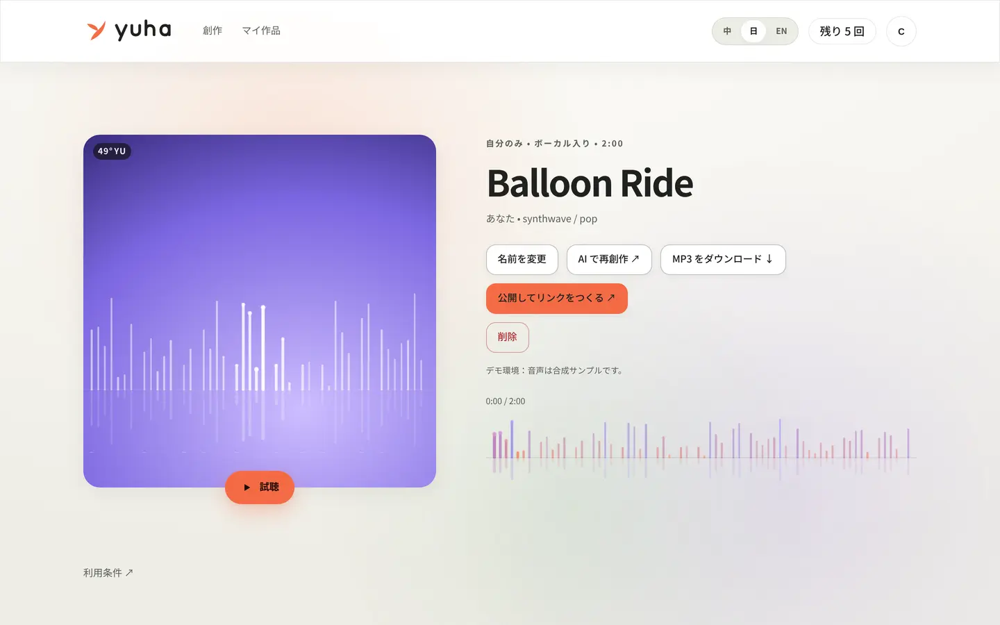
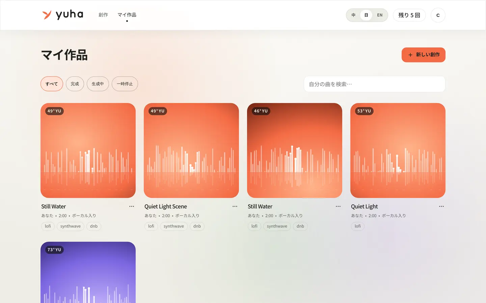
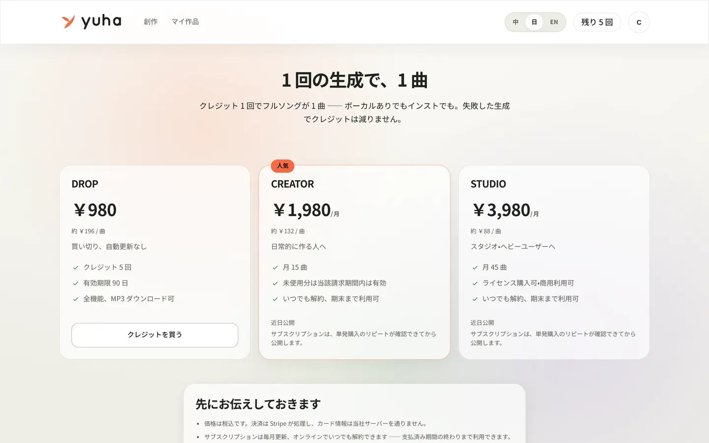
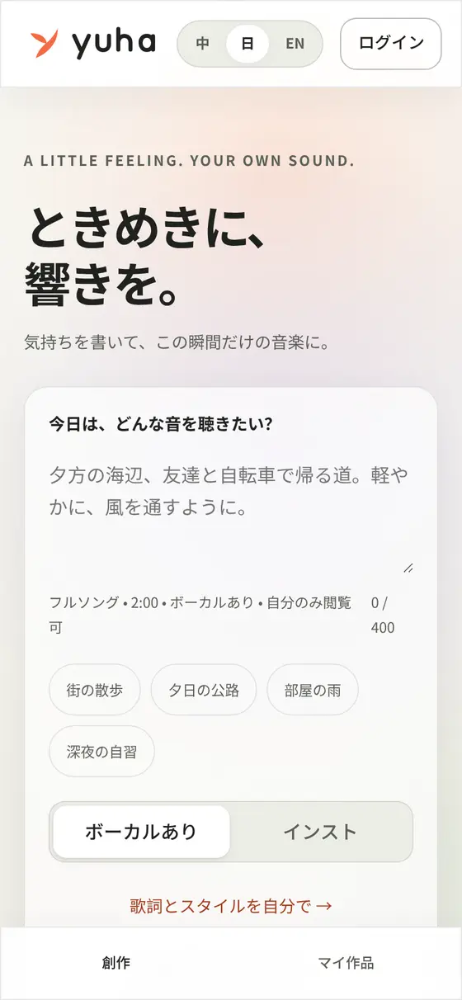
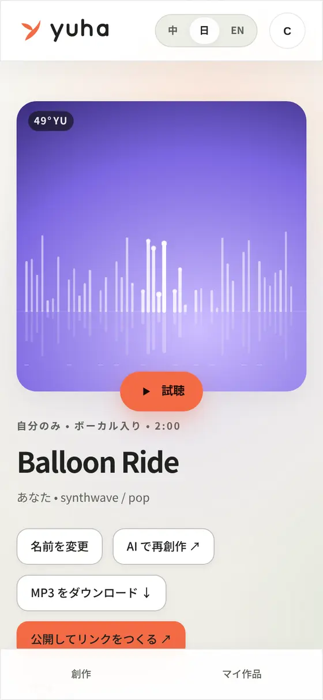
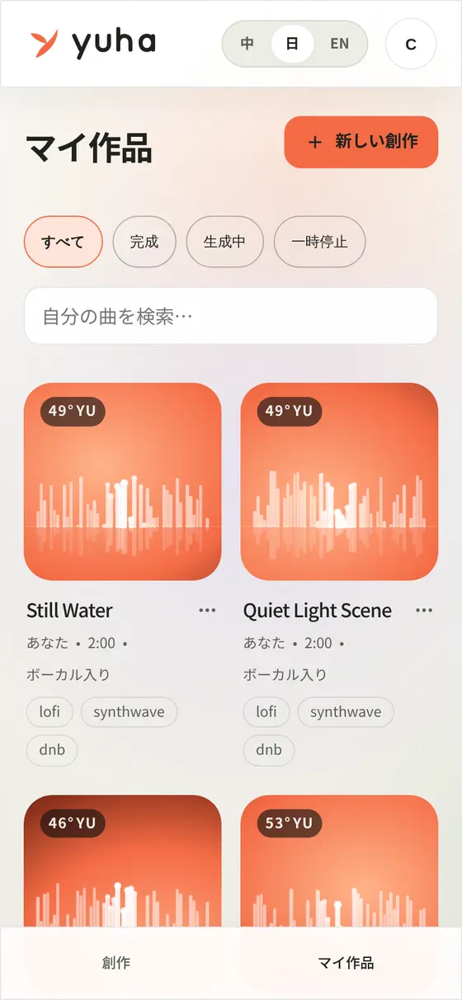

<p align="center">
  
</p>

<p align="center">
  <b>Any song you can describe.</b><br>
  Write how a moment felt. Get a finished song back — sung or instrumental,
  30&nbsp;seconds to four minutes, yours to keep.
</p>

<p align="center">
  
  
  
</p>

<p align="center">
  
</p>

---

## One sentence in, one song out

No DAW, no prompt engineering, no stems to assemble. You type what the moment
felt like — *"夕方の海辺、自転車で友達と帰る道。軽やかに、風を通すように。"* — and
you get a finished track.

- **Full songs, with vocals.** 30 seconds to four minutes. Lyrics written for
  you from your description, or bring your own. Instrumental if you prefer.
- **Decide at the start, not in a settings panel.** The home page asks one
  question (vocals or not) and commits to 2:00. Length, styles, your own
  lyrics and visibility live one click away in the studio.
- **It stays yours.** Songs are private by default. Publishing means handing
  out a link, not joining a feed — there is no public timeline, no likes, and
  no play counter shown to anybody.
- **MP3 you can actually use,** with a per-song record of who wrote it, who
  holds usage rights and what was paid.
- **Three languages.** The whole interface reads in 日本語 / 中文 / English.

## Have a look

<table>
  <tr>
    <td width="50%"><br><sub><b>The studio</b> — describe it, pick a few styles, spend one credit.</sub></td>
    <td width="50%"><br><sub><b>A finished song</b> — cover art, player, MP3, a link to share if you want one.</sub></td>
  </tr>
  <tr>
    <td><br><sub><b>Your library</b> — private, searchable, yours.</sub></td>
    <td><br><sub><b>Pricing</b> — one credit, one song. A failed generation costs nothing.</sub></td>
  </tr>
</table>

<p align="center">
  
  &nbsp;
  
  &nbsp;
  
</p>

<sub>Screenshots taken 2026-10-09 from this commit, running locally in demo
mode — the songs in them are real generations, and the audio behind them is
synthesised rather than modelled (see below).</sub>

## Try it in five minutes

```bash
git clone https://github.com/lth2015/yuha.git && cd yuha
cp .env.example .env     # fill in DEV_AUTH_SECRET and STORAGE_SIGNING_SECRET
pnpm bootstrap           # install, audio fixtures, MySQL, migrate, seed
pnpm dev                 # api :4000 · worker · web :5173
```

Open <http://localhost:5173> and sign in as `creator@example.jp` — a seeded
demo account with 10 credits. Write a sentence, press the button, and a song
is in your library a few seconds later. Everything in the gallery above was
produced this way.

**What "demo mode" means, exactly:** the audio is synthesised from ffmpeg
oscillators rather than generated by a music model, and payments are
simulated. Nothing else is faked — the queue, the worker, the credit ledger,
the licence records and the three-language interface are the real ones, and
the app says which it is where it matters: on the song, in the job while it
runs, at checkout and on the sign-in card. Point `MUSIC_ADAPTER` at a
real provider and `PAYMENTS_ADAPTER=stripe` at test keys and the same build
does the real thing; that is how the payment path was exercised.

[`docs/DEVELOPMENT.md`](docs/DEVELOPMENT.md) has the rest: run modes, the
architecture, the test suite, deployment.

## Where it stands

**Not ready to charge anyone yet.** No music-provider agreement is signed, the
consumer-facing legal text has not been through counsel, and no AWS account has
been provisioned. Demo mode defaults to synthesised audio and simulated
payments, and labels both. The full list is in
[`docs/LAUNCH_READINESS.md`](docs/LAUNCH_READINESS.md) and the live one in
[`docs/OPEN_ITEMS.md`](docs/OPEN_ITEMS.md) — both are kept honest on purpose,
and reading them is the fastest way to understand the project.

What *is* finished is most of the engineering: a test suite that runs against
a real MySQL rather than a stand-in (`pnpm test` prints the count — no number
is quoted here, because a number in a README stops being true quietly), a
credit ledger that survives concurrency, Stripe checkout and webhooks, Google
OAuth with TOTP, rights-complaint handling, and an operations console.

---

## Donated to the NEXT technical community

YUHA's code has been donated to the **NEXT technical community**
(<https://www.netx.world/>), which is its upstream steward: it holds this
repository and decides what is merged and released.

**The service is not the code.** A hosted deployment of YUHA is operated
commercially and separately at yuha.studio. The Stripe account, the
特定商取引法 disclosure, the privacy controller, refunds and support all belong
to that operator and travel with none of this. The steward is not a party to
anybody's purchase, and nothing in this repository names the operator — those
strings come from the deployment's own secret store, and a scripted check
(`pnpm check:stewardship`) fails if that ever stops being true.

If you deploy this, you are the operator of your deployment.
[`GOVERNANCE.md`](GOVERNANCE.md) draws the whole line, including what the
donation has not settled yet.

## Licence

**Apache License 2.0** — [`LICENSE`](LICENSE).

[`NOTICE`](NOTICE) says exactly what that covers, and two carve-outs are worth
knowing before you reuse anything:

| Not under Apache-2.0 | Why |
| --- | --- |
| The name *YUHA*, its wordmark, logos, marks and icons | Apache-2.0 grants no trademark rights (section 6). The code is yours to run; the brand is not. Wherever they appear — `apps/web/public/brand/`, `yuha/YUHA_Design_v1/`, and the vector paths inlined into `apps/web/src/components/Brand.tsx`. |

Until 2026-10-09 the repository also carried five documents belonging to two
other companies, kept as written records of the original brief. They were never
ours to license and have been withdrawn pending advice; code comments that cite
`PROJECT_TASK.md §x` refer to one of them, which is now an internal document.

Contributions are under the same licence (Apache-2.0, section 5) unless the
steward adopts a CLA or DCO; there is no sign-off requirement today. See
[`CONTRIBUTING.md`](CONTRIBUTING.md).

---

## Scope

Built: full-song generation (lyrics sung or instrumental, 30s–4min), the
Simple/Custom studio, a persistent queue player, link sharing on and off, a
private library, MP3 download and trimming, per-song usage and authorship
records, rights-complaint handling, Google OAuth + development login, Stripe
checkout / subscriptions / refunds (JPY catalogue, tax-inclusive: DROP ¥980,
CREATOR ¥1,980/month, STUDIO ¥3,980/month), an async job pipeline with the
credit ledger, and the operations console.

Plays are counted server-side and shown to **nobody**: `playCount` is
deliberately absent from the track view a client receives
(`packages/contracts/src/generation.ts`), so no later change can render it onto
a page by accident. Operations needs to know what gets listened to; a private
song with two plays should not be made to look like a failure.

Deliberately **not** built: a public feed or social graph, likes, creator
revenue sharing, voice imitation of real people, cover versions,
reference-audio upload, music distribution, royalty splitting, Content ID
registration, remixing, annual or unlimited plans, auto top-up, transferable
credit balances, native apps, and video upload or composition.

None of these are reachable through a hidden entry point or a provider default —
`vocalMode` is re-imposed server-side on every request, and the input screen
rejects voice-imitation, quoted-lyrics and artist-reference prompts before any
spend occurs.

## Licensing and the authorship record

A song whose link is open can be licensed by another user (**¥980**,
tax-inclusive, `market_license` catalogue key). The buyer receives per-track
download rights.
The platform sells its own service and does **not** split that revenue with
creators, so there is no earnings ledger and no payout machinery.

What each sale writes is a `track_licenses` row: who authored the song, who
holds usage rights to it, and what was paid, idempotent on the order id. That
record is deliberately kept as a system of record — it is the authorship proof
intended to carry over to on-chain attestation later, and it must outlive any
monetisation model layered on top of it.

## Documentation

| Document | Contents |
| --- | --- |
| [`docs/DEVELOPMENT.md`](docs/DEVELOPMENT.md) | Run it locally, run modes, architecture, the test suite, deployment |
| [`docs/ARCHITECTURE.md`](docs/ARCHITECTURE.md) | Modules, data flow, state machine, schema, design trade-offs |
| [`docs/UI_DESIGN.md`](docs/UI_DESIGN.md) | Design system and direction, with the competitive review behind it |
| [`docs/API.md`](docs/API.md) | Endpoints, error codes, idempotency rules |
| [`docs/OPERATIONS.md`](docs/OPERATIONS.md) | Deploy, refund, compensate, reconcile, alert, roll back, recover |
| [`docs/ACCEPTANCE.md`](docs/ACCEPTANCE.md) | Every UI/GEN/PAY/AI/SEC item with a result and evidence |
| [`docs/ACCEPTANCE_PAYMENTS.md`](docs/ACCEPTANCE_PAYMENTS.md) | What the Stripe sandbox has actually been made to do, and what is still only argued |
| [`docs/STRIPE_WEBHOOK.md`](docs/STRIPE_WEBHOOK.md) | The live webhook endpoint: path, the fourteen events to tick, payload format and API version, where the signing secret lives |
| [`docs/CONFIGURATION.md`](docs/CONFIGURATION.md) | Every environment variable, and which run modes refuse which values |
| [`docs/DEPLOY_AWS.md`](docs/DEPLOY_AWS.md) | The AWS deployment path, none of which has been applied |
| [`docs/UI_CRAFT.md`](docs/UI_CRAFT.md) | The detail rules the interface is held to |
| [`docs/OPEN_ITEMS.md`](docs/OPEN_ITEMS.md) | What is unfinished, what is blocked, and on whom |
| [`docs/LAUNCH_READINESS.md`](docs/LAUNCH_READINESS.md) | What must be true before charging anyone |
